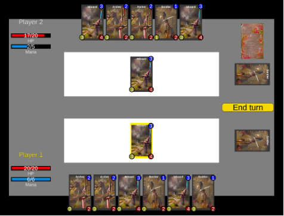

# 🃏 CardGame – User Guide  
**Authors**: Kacper Ćwiertnia, Arkadiusz Mincberger  

## Introduction

Welcome to *CardGame*, a fast-paced strategy card game where your tactical thinking and deck management skills will determine your victory. This guide will help you get started by introducing the game’s interface, rules, and core mechanics.

## 🖥️ Game Interface Overview

The interface consists of several elements that are shared and functionally identical for both players: **Player Stats**, **Deck**, **Hand**, **Board**, **Graveyard**, and the **End Turn button**.

### ▶️ Player Stats

The **Player Stats** section displays the player's name, which is highlighted in yellow when it is that player's turn. It also includes a **Health bar (HP)** showing the current and maximum health, and a **Mana bar**, representing the energy available to play cards from hand onto the board.

### 📚 Deck

The **Deck** contains the cards that will be gradually drawn by the player — typically one card per turn — and added to their hand.

### ✋ Hand

The **Hand** displays the cards currently available to the player. These cards can be played onto the board by spending the required amount of energy, shown in the **blue circle in the top-right corner** of each card.

### 🧩 Board

The **Board** is the area where players place their cards in order to attack the opponent. Once a card is played onto the board, it must wait **one full round** before it becomes active and can be used to attack.

### ⚰️ Graveyard

The **Graveyard** is the area where a player's cards go after they have been defeated in battle. It serves as a discard pile for all eliminated units.

### 🔁 End Turn Button

The **End Turn** button allows the currently active player to finish their turn. Once pressed, control passes to the opposing player.

---

## 📜 Rules

- Each player starts the game with **three cards** in their hand.
- At the beginning of each turn, a player **draws one new card** from their deck.
- **Player 1 always takes the first turn** in the match.
- To play a card onto the board, the player must have at least **as much Mana as indicated by the blue circle** in the top-right corner of the card.
- A player may play as many cards as they want during their turn, as long as they have **enough Mana** to cover the costs.
- At the start of each turn, the player's **maximum Mana increases by one**, starting at **1 Mana** on the first turn.
- A card placed on the board must **wait one full turn** before it can be used to attack.
- Cards can attack either the **opposing player directly**, or their **creature cards** on the board.
- When attacking the **enemy player** the attacking card deals damage equal to the number shown in the **yellow circle** at the bottom-left of the card.
- When **attacking an enemy card**, the attacking card deals its **damage (yellow circle)** to the target, but also **receives damage** in return based on the enemy card’s own yellow circle value — even if the enemy card is not the one initiating the attack.
- If a card’s **health** (indicated by the red circle at the bottom-right of the card) is reduced to zero or below, it is removed from the board and sent to the **Graveyard**, where it can no longer be used for the remainder of the game.
- The game ends when a player’s **HP bar** (the red health bar in the Player Stats panel) is reduced to **zero**.

---

## ⚙️ Game Mechanics

### 🂠 Playing a Card from Hand to the Board

The player can place a card from their hand onto the board as long as they have enough Mana.
To play a card:
1.	Click on the desired card in your hand using the cursor.
2.	Once the card is highlighted in **yellow**, click on your board.
3.	The selected card will automatically move to the board and deduct the appropriate Mana cost.

### ⚔️ Attacking the Opponent Directly

A card can attack the opposing player **only if it has been on the board for at least one full turn**.
To attack the opponent:
1.	Click on the attacking card using the cursor.
2.	Then click on the **opponent’s Player Stats panel**.
3.	The selected card will move toward the opponent, deal its damage, and return to its position on the board.

### 🛡️ Attacking an Opponent’s Card

A card can attack an enemy card only if **it has been on the board for at least one full turn**.
To attack an enemy card:
1.	Click on the attacking card using the cursor.
2.	Then click on the **target card** on the opponent’s board.
3.	The attacking card will move toward the target, deal its damage, receive counterattack damage, and return to the board.

### 🔚 Ending the Turn

At any time during their turn, the player can click the **"End Turn"** button located on the **right side** of the screen to pass the turn to the opponent.